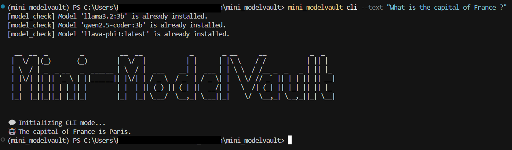
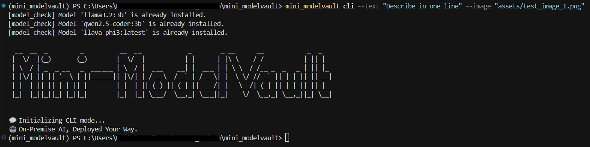

# mini-modelvault

> Run LLMs, vision, and more — all on your own hardware, with full privacy and control.

---

## 🚀 Overview

**mini-modelvault** is a lightweight, ready-to-run AI platform that lets you run large language models (LLMs), vision models, and more, locally. Enjoy full privacy, no vendor lock-in, and blazing-fast inference on your own hardware.

---

## 🖼️ Screenshots

| CLI (General LLM) | CLI (Vision Model) |
|:-----------------:|:------------------:|
|  |  |

*Example: CLI output for a general LLM prompt (left) and a vision model prompt (right).*

---

## 📁 Folder Structure

```
mini_modelvault/
├── assets/                # Example/test images
├── logs/                  # Log files (rotated daily, always at project root)
├── screenshots/           # Example screenshots for README
├── mini_modelvault/
│   ├── __init__.py
│   ├── main.py        # Main entry point (CLI/HTTP launcher)
│   ├── logger/
│   ├── observability/
│   ├── router/
│   ├── services/
│   └── utils/
├── test/
│   ├── cli/               # CLI test prompts
│   └── http/              # HTTP API test scripts and Postman collection
├── .env                   # Environmental Variables
├── pyproject.toml         # Project metadata and dependencies
├── requirements.txt       # Requirements file
├── LICENSE                # MIT License
└── README.md              # This file
```

---

## ⚡ Quick Start

### 1. Prerequisites
- Python **3.13+**
- Git
- [uv](https://github.com/astral-sh/uv) (fast Python package manager; [installation guide](https://github.com/astral-sh/uv#installation))
- (Optional) NVIDIA GPU for vision model acceleration
- [Ollama](https://ollama.com/) running locally for model backend (see below)

### 2. Installation
#### Option A: pipx (Recommended for CLI)
```bash
$ git clone
$ cd mini_modelvault
$ pip install pipx  # if not already installed (Add PATH to env). Refer - https://github.com/pypa/pipx
$ pipx install .    # from the project root
```

#### Option B: Manual/Dev Install
```bash
# Clone the repo
$ git clone
$ cd mini_modelvault

# Install dependencies using uv (recommended)
$ uv venv
$ uv pip install -r requirements.txt
# Or install directly from pyproject.toml
$ uv pip install -r <(uv pip compile pyproject.toml)
```

### 3. Model Setup (Ollama)
- Download and run [Ollama](https://ollama.com/) locally
- Pull required models (e.g., `llama3.2:3b`, `qwen2.5-coder:3b`, `llava-phi3:latest`) using:
  ```bash
  ollama pull llama3.2:3b
  ollama pull qwen2.5-coder:3b
  ollama pull llava-phi3:latest
  ```
- Set environment variables for model names (optional) or refer .env.example:
  ```bash
  export MODEL_GENERAL=llama3.2:3b
  export MODEL_CODING=qwen2.5-coder:3b
  export MODEL_VISION=llava-phi3:latest
  ```

### 4. Running mini-modelvault

#### CLI Mode
```bash
# If installed with pipx (recommended):
$ mini_modelvault cli --text "What is the capital of France?"
$ mini_modelvault cli --image "assets/test_image_1.png" --text "Describe this image."
$ mini_modelvault cli
```

#### Dev Mode CLI (from source)
```bash
# Run CLI or HTTP server using module syntax
$ uv run -m mini_modelvault.main cli --text "What is the capital of France?"
$ uv run -m mini_modelvault.main cli --image "assets/test_image_1.png" --text "Describe this image."
$ uv run -m mini_modelvault.main cli
```

#### HTTP Server Mode
```bash
# If installed with pipx:
$ mini_modelvault http
# If running directly (dev mode):
$ uv run -m mini_modelvault.main http
# Server will run at http://127.0.0.1:8000
```

#### API Usage Examples
- **POST /generate**: Run inference (text and/or image, streaming optional)
- **GET /health**: Health check
- **GET /status**: Resource usage

**Curl Example:**
```bash
curl --location -N 'http://localhost:8000/generate?stream=true' --form 'text="Tell me a joke"'
curl --location -N 'http://localhost:8000/generate?stream=true' --form 'text="Extract text in the image"' --form 'file=@"assets/test_image_1.png"'
```

**Postman:**
- See `test/http/postman/mini_modelvault.postman_collection.json` for ready-to-use API requests.

---

## 🛠️ Developer Guide

### Prerequisites
- Python 3.13+
- [Ollama](https://ollama.com/) for local model serving
- (Optional) NVIDIA GPU and `nvidia-smi` for GPU monitoring

### Installation
- Use `pip`, `uv`, or `pipx` to install dependencies from `pyproject.toml` or `requirements.txt`.
- All code is in the `mini_modelvault/` directory, organized by feature.

### Running
- Use `mini_modelvault run (or) uv run -m mini_modelvault.main` to launch the CLI or HTTP server.
- All logs are written to the `logs/` directory (rotated daily).
- Models are routed via `mini_modelvault/router/router.py` using LangChain and Ollama.

### Testing
- **CLI prompts:** See `test/cli/test_prompts.txt`
- **HTTP API:**
  - `test/http/curl.txt` for curl examples
  - `test/http/postman/mini_modelvault.postman_collection.json` for Postman

### Logging & Observability
- Logging is handled by [loguru](https://github.com/Delgan/loguru), with daily rotation and rich formatting.
- Health and resource endpoints (`/health`, `/status`) provide live status and device metrics (RAM, CPU, GPU).
- GPU monitoring uses `nvidia-smi` (if available).

### 📜 Logging

- Log files:
  - `logs/main.log` — main app events
  - `logs/cli.log` — CLI events
  - `logs/server.log` — HTTP server events

---

## 🌟 Opportunities for Improvement & Feature Ideas

Here are some ways to further enhance mini-modelvault:

1. **Sidecar Design Pattern for Health & Status Checks with Snapshots**
   - Implement a sidebar UI (web or TUI) that continuously displays live health and status information, including RAM, CPU, GPU, and model status. Add the ability to view historical resource usage snapshots for better observability and troubleshooting. This would provide users with real-time and historical insights at a glance, improving monitoring and debugging.
2. **User Authentication & API Key Management**
   - Add user accounts and API key support for secure, multi-user access to the HTTP API.
3. **Web-based Model Management Dashboard**
   - Build a simple web UI to monitor running models, manage settings, and view logs/usage in real time.
4. **Advanced Analytics & Usage Reporting**
   - Integrate analytics to track usage, performance, and errors, with exportable reports for admins.

Feel free to open an issue or pull request if you want to work on any of these features or suggest your own!

---

## ⚖️ Tradeoffs

1. Local inference ensures privacy but requires strong hardware for large models.
2. Using Ollama and LangChain adds flexibility but increases setup and dependency complexity.
3. Running everything locally means no cloud costs, but updates and scaling are fully manual.

---

## 📜 License

This project is licensed under the MIT License. See [LICENSE](LICENSE) for details.

---

## 🙏 Acknowledgements
- [LangChain](https://github.com/langchain-ai/langchain)
- [Ollama](https://ollama.com/)
- [FastAPI](https://fastapi.tiangolo.com/)
- [Loguru](https://github.com/Delgan/loguru)
- [Typer](https://typer.tiangolo.com/)
- [Yaspin](https://github.com/pavdmyt/yaspin)
